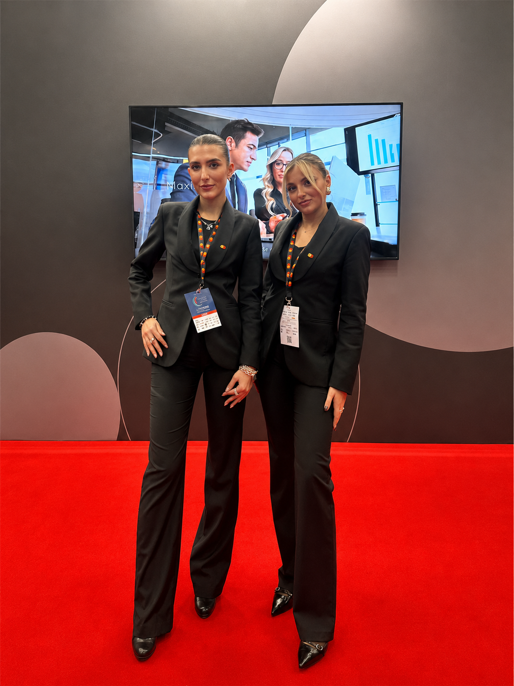

# Immagini: dove metterle e come chiamarle

Le foto vanno nella cartella `images/`, i loghi dei brand in `images/loghi/`.
Il sito le cerca già con questi nomi: appena il file c'è, la foto compare.

**Procedura, per ogni foto:**
1. Trova la foto sul computer (o salvala dal sito attuale: tasto destro, Salva immagine con nome)
2. Rinominala col nome esatto della tabella
3. Trascinala dentro `images/`
4. Aggiorna la pagina nel browser

Il nome deve coincidere carattere per carattere. `hero.jpg` e `Hero.JPG` sono due cose diverse.
Se la tua foto è .png o .jpeg invece di .jpg, chiedimi di adattare il codice.

---

## PRIORITÀ 1 — le tre che cambiano tutto

| Nome file | Cosa metterci |
|---|---|
| `hostess-anteprima-paramount-cinecitta-roma.jpg` | Paramount+, Cinecittà, Roma. È la grande foto di apertura della home: orizzontale, min. 2000px di larghezza |
| `agenzia-hostess-steward-eventi-roma.jpg` | Un evento a Roma, immagine forte |
| `agenzia-hostess-steward-eventi-milano.jpg` | Un evento a Milano, immagine forte |

## PRIORITÀ 2 — le altre città

| Nome file | Cosa metterci |
|---|---|
| `agenzia-hostess-steward-eventi-firenze-pitti.jpg` | Firenze |
| `agenzia-hostess-steward-eventi-venezia-biennale.jpg` | Venezia |
| `agenzia-hostess-steward-fiere-bologna.jpg` | Bologna |
| `agenzia-hostess-steward-congressi-napoli.jpg` | Napoli |
| `agenzia-hostess-steward-eventi-bari-puglia.jpg` | Bari o Puglia |
| `agenzia-hostess-steward-eventi-costa-smeralda-sardegna.jpg` | Sardegna |
| `agenzia-hostess-steward-eventi-taormina-sicilia.jpg` | Sicilia |

> Se in una città non hai ancora lavorato, va bene una tua fotografia del luogo.
> Meglio un'immagine bella e pertinente che un riquadro vuoto.

## PRIORITÀ 3 — i lavori (portfolio e home)

| Nome file | Cosa metterci |
|---|---|
| `hostess-evento-damiani-centenario-milano.jpg` | Damiani, Centenario, Teatro Alcione, Milano |
| `hostess-sfilata-pucci-palazzo-altemps-roma.jpg` | Pucci, Palazzo Altemps, Roma |
| `hostess-cena-gala-etro-roma.jpg` | Etro, Teatro delle Bellezze, Roma |
| `hostess-fiera-mastercard-salone-pagamenti-milano.jpg` | Mastercard, Salone dei Pagamenti, Milano |
| `promoter-napapijri-fashion-week-milano.jpg` | Napapijri, Fashion Week |
| `promoter-kraken-barshow-roma.jpg` | Kraken, Barshow, Roma |
| `promoter-select-tour-milano.jpg` | Select Tour, Milano |
| `hostess-evento-playmobil-vespa-roma.jpg` | Playmobil e Vespa, Stadio dei Marmi, Roma |
| `hostess-evento-vanity-fair-venezia-lido.jpg` | Vanity Fair, Venezia Lido, 2025 |

## PRIORITÀ 4 — il team (pagina Chi siamo)

Formato verticale, ritratto.

| Nome file | Chi |
|---|---|
| `valeria-founder-mind-the-gap-agency.jpg` | Valeria |
| `valentina-finance-mind-the-gap-agency.jpg` | Valentina |
| `lucrezia-hr-recruiting-mind-the-gap-agency.jpg` | Lucrezia |
| `mini-gasgas-mascotte-mind-the-gap.jpg` | Mini GasGas |

## PRIORITÀ 5 — i loghi dei brand

Cartella `images/loghi/`. Se non li metti, il sito mostra i nomi in Bodoni,
che è comunque elegante: valuta se preferisci così.

`dior.png` · `chanel.png` · `porsche.jpg` · `cartier.png` · `etro.jpg` · `pucci.png` ·
`damiani.png` · `elie-saab.png` · `zuhair-murad.png` · `sephora.png` · `pirelli.png` ·
`mastercard.png` · `spotify.png` · `napapijri.png` · `woolrich.jpg` · `leam.jpeg` ·
`nexi.png` · `kraken.png` · `select.png` · `1664-blanc.png` · `marc-cain.jpg` · `gap.png`

---

## Prima di caricarle: comprimile

Vai su **squoosh.app** (gratuito, si trascina l'immagine e si riscarica).
Obiettivo: **sotto i 300 KB** per le foto, **sotto i 40 KB** per i loghi.
Le foto originali pesano spesso 5-8 MB l'una: con venti immagini così il sito
diventa lentissimo e Google penalizza i siti lenti.

## Perché questi nomi lunghi

Google legge il nome del file. `agenzia-hostess-steward-eventi-roma.jpg` gli dice
di cosa parla l'immagine, `IMG_4032.jpg` no. Aiuta soprattutto su Google Immagini.
Il testo alternativo, che conta di più, è già scritto nel sito.

---

## Peso delle immagini: obiettivi

| Tipo | Peso massimo | Larghezza |
|---|---|---|
| Foto di apertura (Paramount) | **250 KB** | 2000 px |
| Foto città | 150 KB | 1600 px |
| Foto lavori | 150 KB | 1400 px |
| Foto team | 100 KB | 800 px |
| Loghi | 40 KB | — |

**Come:** su **squoosh.app** trascina la foto, scegli formato **WebP** a destra,
imposta la larghezza in *Resize*, e abbassa la qualità finché il peso indicato in
basso rientra nell'obiettivo. Intorno a 75 di qualità la differenza non si vede.

Se salvi in WebP il file finisce con `.webp` invece di `.jpg`: dimmelo e adatto
il codice, oppure rinomina mantenendo `.jpg` (funziona lo stesso, i browser
riconoscono il formato dal contenuto).

## Cosa fa già il sito da solo

- La foto di apertura viene scaricata con priorità massima, prima di tutto il resto
- Tutte le altre immagini si caricano solo quando stai per arrivarci scorrendo
- Questo significa che aprendo la home il browser scarica **una sola foto**, non venti

---

## Se una foto si taglia male

Le foto vengono ritagliate per entrare nel riquadro, e per impostazione predefinita
il sito tiene la parte **centrale, leggermente verso l'alto** (dove di solito stanno
i volti). Se su una foto il taglio non funziona, puoi decidere tu quale parte tenere.

Apri il file della pagina, trova la riga dell'immagine e aggiungi una di queste
parole dentro il tag, subito dopo `<img`:

| Scrivi | Risultato |
|---|---|
| `class="altissimo"` | tiene la parte più alta della foto |
| `class="alto"` | sposta il taglio verso l'alto |
| `class="centro"` | esattamente al centro |
| `class="basso"` | sposta il taglio verso il basso |
| `class="bassissimo"` | tiene la parte più bassa |
| `class="sinistra"` | tiene la parte sinistra |
| `class="destra"` | tiene la parte destra |

**Esempio.** Se la foto di Napoli taglia le teste, da così:

    

diventa così:

    

Ricordati che la stessa foto compare in più pagine (home, Dove operiamo, versione
inglese): se la correggi, correggila ovunque. In alternativa chiedimi di farlo io,
dicendomi solo quale città e in che direzione spostare.

### Consiglio pratico
Il modo migliore per evitare il problema è **scegliere foto orizzontali con il
soggetto abbastanza centrato**. Le foto molto verticali o con il soggetto in un
angolo si taglieranno sempre male, qualunque impostazione.

---

## Foto del portfolio (nuove)

Queste servono per le nuove schede del portfolio. Metti quelle che hai:
le schede senza foto mostrano il riquadro col nome del file, quindi puoi
completarle con calma.

| Nome file | Progetto |
|---|---|
| `hostess-evento-cartier.jpg` | Cartier |
| `hostess-festival-cinema-venezia.jpg` | Festival del Cinema, Venezia |
| `hostess-evento-spotify-wrapped-milano.jpg` | Spotify Wrapped, Milano |
| `steward-evento-valentino-roma.jpg` | Valentino, Roma |
| `promoter-select-spritz-tour-firenze.jpg` | Select Spritz Tour, Firenze |
| `promoter-kraken-tour-bologna.jpg` | Kraken Tour, Bologna |
| `hostess-spotify-sanremo-2024.jpg` | Spotify, Sanremo 2024 |
| `hostess-spotify-sanremo-2025.jpg` | Spotify, Sanremo 2025 |
| `hostess-matrimonio-sardegna.jpg` | Matrimonio in Sardegna |
| `hostess-matrimonio-da-vittorio.jpg` | Matrimonio Da Vittorio |
| `hostess-accoglienza-cipriani.jpg` | Accoglienza Cipriani |
| `promoter-lego-sanremo.jpg` | LEGO, Sanremo |
| `promoter-select-tour-bologna.jpg` | Select Tour, Bologna |
| `promoter-select-spritz-week-venezia.jpg` | Select Spritz Week, Venezia |
| `hostess-marc-antoine-barrois-salone-del-mobile-milano.jpg` | Marc-Antoine Barrois, Salone del Mobile |
| `hostess-rinascente-milano-cortina.jpg` | Rinascente, Milano Cortina |
| `hostess-mastercard-verona.jpg` | Mastercard, Verona |

Le foto delle schede portfolio si vedono in un riquadro verticale: scegli
immagini dove il soggetto non è troppo lontano.

**Nuova foto team:** `laura-gestione-personale-mind-the-gap-agency.jpg` (Laura D.)
Le foto del team ora sono tonde: usa scatti dove il viso è centrato.

---

## Nuove foto richieste (ultimo aggiornamento)

| Nome file | Progetto |
|---|---|
| `hostess-evento-campari-cittadella-archivi-milano.jpg` | Campari, Cittadella degli Archivi, Milano 2026 |
| `promoter-asics-fuorisalone-milano.jpg` | ASICS, Fuorisalone Milano 2026 |
| `laura-gestione-personale-mind-the-gap-agency.jpg` | Laura D. (team) |

**Nomi file invariati, contenuto cambiato:** queste schede hanno cambiato nome
sul sito ma usano lo stesso file, quindi non devi rinominare nulla:

- `hostess-festival-cinema-venezia.jpg` → ora è **Marciano by Guess**, Festival del Cinema Venezia 2024
- `hostess-accoglienza-cipriani.jpg` → ora è **Cipriani**, Festival del Cinema Venezia 2024
- `hostess-rinascente-milano-cortina.jpg` → ora è **Rinascente**, Olimpiadi Milano Cortina 2025
- `hostess-matrimonio-da-vittorio.jpg` → ora è **Da Vittorio**, Bergamo 2025, evento privato
- `hostess-matrimonio-sardegna.jpg` → ora è **Sardegna 2026**, evento privato

## Loghi: l'elenco è salito a 35 marchi

Se non carichi il file del logo, compare il nome del brand in Bodoni, con colori
alternati dalla palette del sito. I nuovi da aggiungere in `images/loghi/` se li hai:
`valentino.png` · `marciano-guess.png` · `marc-antoine-barrois.png` · `campari.png` ·
`asics.png` · `rinascente.png` · `paramount.png` · `vanity-fair.png` · `cipriani.png` ·
`da-vittorio.png` · `lego.png` · `playmobil.png` · `vespa.png`
